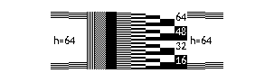
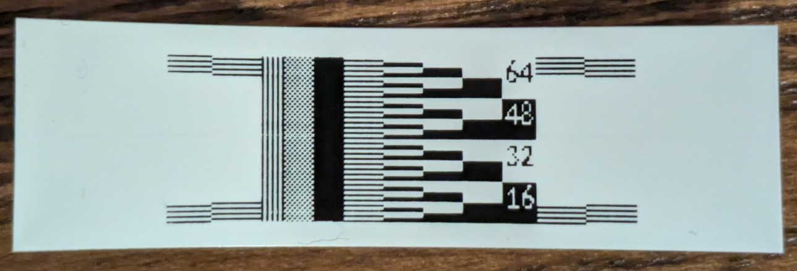
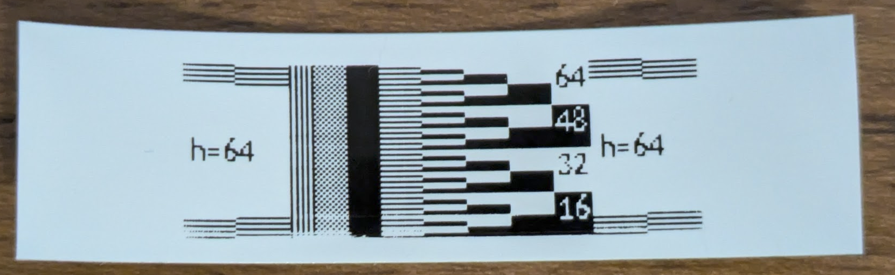
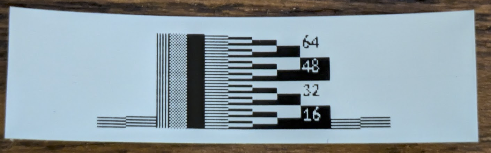
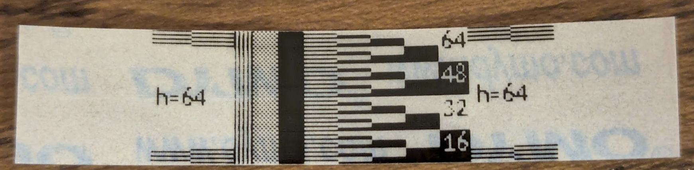
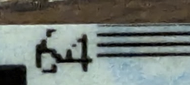

# How to calibrate the label margins of DYMO printers

Calibration can be used to determine:

* Is the print head clean?
* If the printer or tape has not yet been measured and recorded in Labelle, then:
  * How many pixels and what resolution does the print head have?
  * For a given tape, which pixels correspond to which part of the tape?

Since most Labelle contributors have only a single printer and tape,
we rely on the community to provide the necessary information to support
other devices and tape sizes. You do not need to understand the entire process
to contribute; we are happy to help you interpret the results. Please see
[submitting calibration data](#submitting-calibration-data) for a detailed summary
of the process.

We track the status of supported devices
[here](https://github.com/labelle-org/labelle/issues/4).

## General information

Each model of DYMO printer has a stationary print head of some fixed height.
Calibration consists of printing a sample pattern of that same height.
(If the height of the print head is unknown, see
[determining the height of the print head](#determining-the-height-of-the-print-head).)

Many DYMO printers have a print head that is 64 pixels high, and such a
sample pattern can be printed with the command

```shell
labelle --sample-pattern 64
```

resulting in a pattern like this:

<!-- markdownlint-disable MD033 -->

<!-- markdownlint-enable MD033 -->

Here is this pattern printed on 12mm tape with a DYMO LabelManager PnP:



### Counting rows

The numbering of printable rows increases from bottom to top.
To make counting more human-friendly, we start counting with 1.
Thus in the example above, the bottom row is 1 and the top row is 64.
Groups of 16 pixels in alternating colors are indicated by the numbers.
The 48th row is the topmost row within the black block marked as 48.
The dyadic checkerboard to the left of the numbers is designed to help with
counting individual rows of pixels.
It consists of alternating groups of 8, 4, 2, and 1 pixels.

Around each of the four corners of the pattern are groups of four
staggered horizontal lines.
These are helpful for checking whether or not the topmost and bottommost
pixels are printed correctly.

### Tape sizes

Many DYMO printers support 6mm, 9mm, and 12mm D1 tapes
and have a 64 pixel print head with a 9mm printable height.

The LabelManager PC II has a 128 pixel print head with an 18mm printable height.
This makes it practical for use with the larger 19mm and 24mm D1 tapes.
An unofficial list of DYMO printers and compatible tape sizes
can be found [here](https://www.labelcity.com/dymo-d1-label-tape-compatibility-guide).

When the tape is shorter than the printable height, the tape occupies
some range of pixels near the middle of the print head.

The procedure to determine the pixel range of a tape is described in
[determining the pixel range of a tape](#determining-the-pixel-range-of-a-tape).

## Checking the cleanliness of the print head

When the print head is dirty, some rows will print inconsistently, faintly,
or not at all. In the following example we see several problematic rows
along the bottom.



Many DYMO printers come with a yellow brush for cleaning the print head, as
illustrated in [this video](https://www.youtube.com/watch?v=tu3jLmO06zE).

After gently cleaning the print head, the sample pattern should print sharply,
similarly to the other photos in this document.

## Determining the height of the print head

The height of the print head can be determined by printing a sample
pattern of very large height.
(In order to achieve conclusive results, the tape size must be larger than
the print head.)
Simply print a sample pattern that is very large and it will be
truncated at the top.
The height of the print head is the topmost row that is printed, assuming
that there is a margin at the top of the tape.

For example, on the DYMO LabelManager PnP, the command

```shell
labelle --sample-pattern 512
```

prints the following label, from which we conclude that the print head
is 64 pixels high:



## Determining the pixel range of a tape

Some [tapes](#tape-sizes) may not span the full printable height of the print head.
For such tapes, we want to [identify which pixel rows](#counting-rows) correspond
to the tape's bottom and top edges.

We can identify the precise range of pixels by means of
a sample pattern of a given height.



In this example, the bottom row is 2 and the top row is 64. The easiest way to
see this is that the top corners have all four pairs of staggered lines, while
along the bottom corners the bottommost line is missing.

Alternatively, it is possible to use the dyadic checkerboard to count down
from the top of the 16-block to obtain 2 at the bottom. It is similarly
possible to count up from the top of the 48-block to obtain 64 at the top.

Note that it is possible that the tape shifts up or down by a pixel depending
on how the cartridge is inserted into the printer. It is also possible that rows
along the top or bottom edges are faded, as shown here:



## Submitting calibration data

Thank you for taking the time to submit calibration data!

The developers of Labelle are grateful for any information you can provide,
and will help you to interpret the calibration results.
Please report the results in a
[new issue](https://github.com/labelle-org/labelle/issues/new).

Ideally the results should include one or more photos of the printed sample patterns.
The photos should be high enough resolution to show the individual pixels.

If the device is not yet supported, then the first step is to determine the height
of the print head. See
[determining the height of the print head](#determining-the-height-of-the-print-head).

Please also measure the height in mm of the sample pattern so that we can determine
the resolution of the print head.
Please also measure the top and bottom margins in mm.

It may be necessary to
[clean the print head](#checking-the-cleanliness-of-the-print-head) to ensure
accurate results.

If you have alternate tape sizes, please provide photos that
[show the pixel range of the tape](#determining-the-pixel-range-of-a-tape).

Checklist:

* The height of the print head in pixels is determined if not previously known.
* The height of the sample pattern in mm is measured if not previously known.
* The print head is clean.
* For each tape size that you have:
  * A photo of the sample pattern is provided.
  * Measurements in mm of the top and bottom margins if the sample pattern doesn't
    extend to the edges of the tape.
* This information is submitted in a new GitHub issue.

Example: See [#60](https://github.com/labelle-org/labelle/issues/60)
