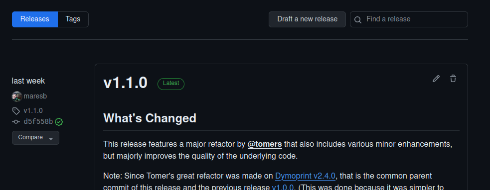
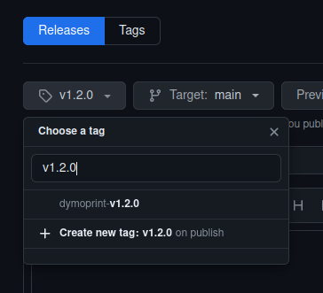
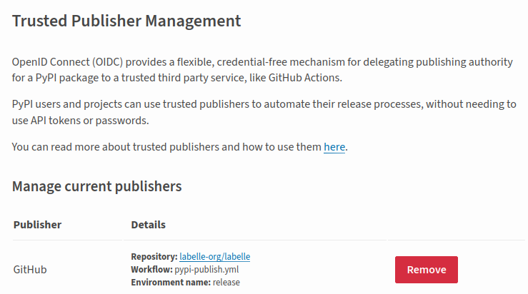

# Deployment Instructions

Here's the instructions to draft a new release:

1. **Preparation**
   - Ensure you have the latest version of the code from the main branch.

2. **Test**
   - Check that all unit tests pass: run `tox` and `pre-commit run -a`.
   - Make some sanity tests on real labeler printer.

3. **Deploy**
   - In "Releases" view, click "Draft a new release":

     

   - Choose a new tag name according to semver and set to "Create new tag on publish":

     

   - Click "Generate release notes" to get automatic release notes based on the
     merged PRs, add any additional notes, and hit "Publish release".

     That will trigger a pending Actions workflow to upload to PyPI that
     requires manual approval from a maintainer. Approve, then it will run,
     and should create a release.

4. **Verify**
   - Once deployed, verify the application is running as expected.
   - Check the application logs for any unnoticed issues.

## Additional Info

GitHub Actions is trusted by PyPI, and it generates a certificate saying that a package
upload request is coming from labelle-org/labelle under the release environment.
PyPI is configured to accept exactly such a certificate:

